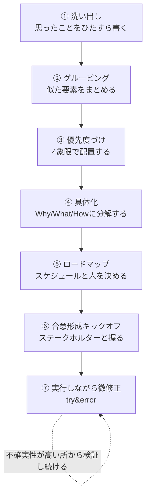
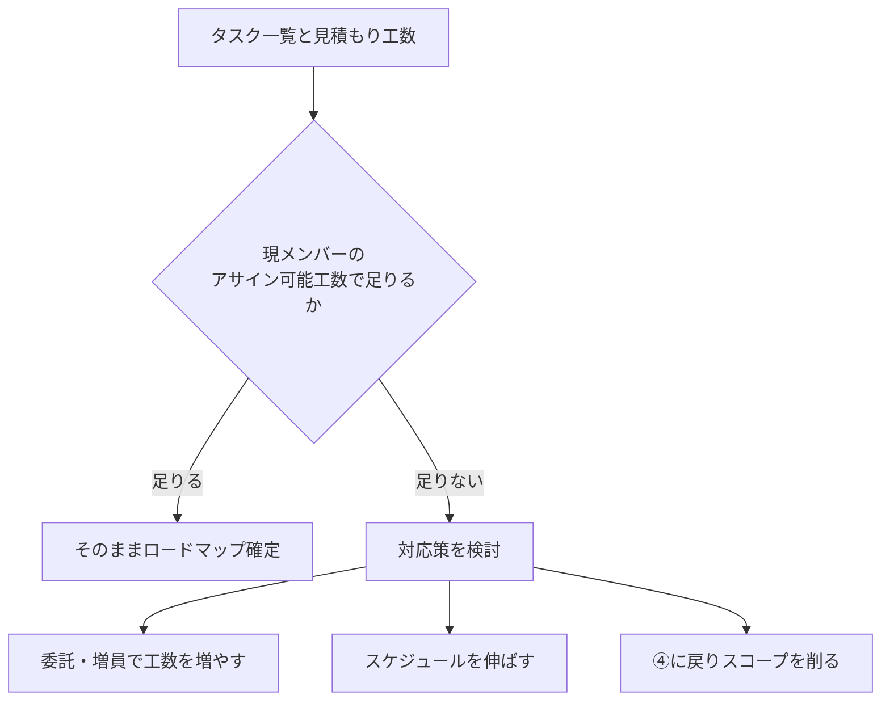

データエンジニアがチームをまとめる立場になると、コードを書く力とは別に、**1つのプロジェクトを立ち上げて最後まで走り切る力**が必要になります。とくにモデリング開発のように、事業部との連携が必須で、要件があいまいなまま始まりがちなプロジェクトほど、この力の差が結果を大きく左右します。

この記事では、実際にデータ基盤のモデリング開発プロジェクトを回すときに使っている型を、抽象的な考え方から具体的な進め方まで一気通貫で整理します。

## 注意

- 執筆にあたり細心の注意を払っておりますが、不十分な説明や誤りがある可能性もございます。
- 本発言はあくまで私個人の意見・見解であり、所属する会社等の公式な立場や見解を示すものではございませんので、あらかじめご承知おきください。

## この記事で扱う例

抽象論だけだとイメージが湧きにくいので、この記事では一貫して次のようなプロジェクトを例に使います。

> 事業部から「注文データの分析基盤を刷新したい」という相談が来た。既存の注文テーブルは正規化が甘く、事業部ごとに独自の集計ロジックが乱立している。データエンジニアであるあなたがPMとして、モデリング設計から事業部との合意形成までを主導することになった。

このように**要件が固まっておらず、事業部との連携が必須で、技術検討と業務理解の両方が求められるプロジェクト**は、データエンジニアがPMを任されるときの典型パターンだと思います。

## 全体像——7ステップの型

この手のプロジェクトで使っている流れは、次の7ステップです。

ポイントは、**抽象的な思考(①〜②)から始まり、意思決定(③)を経て、具体のタスク(④〜⑤)に落とし込み、最後に人を巻き込んで走り出す(⑥〜⑦)**という一本の流れになっていることです。順番を飛ばすと、たいてい途中でどこかに歪みが出ます。以下、順番に見ていきます。

## ① 洗い出し——思ったことをひたすら書く

最初にやるのは、頭の中にあることをとにかく全部書き出すことです。この段階では**取捨選択も構造化もせず、思いついたことをそのまま書く**ことに徹します。

先ほどの例で言えば、こんな粒度がバラバラのメモが並ぶイメージです。

- 既存の注文テーブルの正規化が甘い
- 事業部ごとに集計ロジックが違う
- 事業部が使っている指標の定義を誰も文書化していない
- 過去に似た刷新を試みて頓挫した経緯がある
- 事業部側の主要メンバーが異動する可能性がある
- dbtでモデリングし直すなら既存ダッシュボードへの影響範囲を洗い出す必要がある
- 事業部の意思決定者が誰なのかまだ分かっていない
- テストデータの整備状況が不明

この段階で重要なのは、**「これは技術の話」「これは業務の話」といった分類を一切せずに、思考を止めずに出し切る**ことです。分類しながら書こうとすると、その場で「これは重要じゃないかも」と無意識に取捨選択してしまい、後工程で拾えたはずの論点を取りこぼします。**洗い出しの目的は網羅性であって、整理ではありません。**

## ② グルーピング——似た要素をまとめる

洗い出しが終わったら、次はバラバラに出した要素を**似た性質でグルーピング**します。先ほどのメモは、たとえばこう整理できます。

| グループ | 含まれる要素 |
|---|---|
| 技術的負債 | 正規化が甘い、指標定義が未文書化、テストデータ未整備 |
| 事業部との連携 | 集計ロジックの乱立、意思決定者不明、過去の頓挫経緯 |
| 組織・体制リスク | 事業部メンバーの異動可能性 |
| 影響範囲 | 既存ダッシュボードへの影響、移行時のデータ整合性 |

グルーピングの効果は2つあります。1つは**論点の数を圧縮できる**こと。8個の付箋が4つの塊になれば、この後の意思決定の負荷が大きく下がります。もう1つは、**同じグループの中に矛盾する要素がないか気づける**ことです。たとえば「事業部との連携」の中に「意思決定者が不明」と「過去に頓挫した経緯がある」が並んでいれば、この2つは実は同じ根っこの問題である可能性に気づけます。

## ③ 優先度づけ——4象限で工数とインパクトを見る

グルーピングした論点を、次は**優先度**という軸で並べ替えます。使っているのは、縦軸に事業インパクトの大小、横軸に工数の多い少ないを取った4象限です。

| | 工数:少ない | 工数:多い |
|---|---|---|
| **インパクト:大** | 最優先で着手 (例: 指標定義の文書化) | 計画的に投資 (例: モデリング全面刷新) |
| **インパクト:小** | 手が空いたら着手 (例: テストデータ整備) | やらない候補 (例: 過去踏襲の集計ロジック温存) |

この4象限を作る目的は、**「やる/やらない」を感覚ではなく座標で決める**ことです。とくに右下(工数が多くインパクトが小さい)に置かれたものは、**この時点で「やらない」と明言する候補**になります。あとで触れますが、この「やらないことを決める」勇気こそが、プロジェクトの成否を分ける要素だと感じています。

先ほどの例では、「指標定義の文書化」が左上に来ます。工数は小さいのに、事業部との認識齟齬を防ぐ効果が大きいため、実は着手順としてはモデリング刷新そのものより優先すべき、という判断ができます。**4象限に置いてみて初めて見える優先順位**があるのが、この工程の価値です。

## ④ 具体化——Why・What・Howにドリルダウンする

優先順位がついたら、上位の論点を**Why → What → How**の順にドリルダウンして、実行可能なタスクまで落とし込みます。

「指標定義の文書化」を例にすると、こう分解できます。

| 階層 | 内容 |
|---|---|
| Why | 事業部ごとに集計ロジックが違い、意思決定の数字が部署間で食い違っている |
| What | 主要KPIの定義書(算出ロジック・粒度・除外条件)を事業部と合意して作る |
| How | 事業部の主要指標利用者にヒアリング→現行ロジックの棚卸し→差分を洗い出し→定義案を作成→事業部レビュー→確定 |

ここで大事なのは、**Whyを飛ばしてWhatやHowから考え始めない**ことです。Whyが曖昧なまま「定義書を作る」というWhatだけ決めてしまうと、事業部から「なぜ今それをやるのか」と聞かれたときに答えに詰まります。逆にWhyまで握れていれば、Howの途中でつまずいても「そもそも何のためにやっているか」に立ち返って軌道修正できます。**Howまで分解しきって初めて、見積もりが可能なタスクになる**という点も重要です。④が終わった時点で、初めて工数見積もりの精度が上がります。

## ⑤ ロードマップ——スケジュールと人を決める

具体化されたタスク群に対して、次は**誰が・いつやるか**を決めます。ここで必ず自問すべきなのが、「今のメンバーでそもそも実現可能か」です。

ここで踏みがちな失敗は、**「気合でなんとかなる」という前提でロードマップを引いてしまう**ことです。見積もりの時点で足りないと分かっている工数を精神論で埋めようとすると、必ず後半で炎上します。足りないなら、**委託を増やす・スケジュールを伸ばす・スコープを削る、のいずれかを機械的に選ぶ**というルールを自分に課すようにしています。

先ほどの例で言えば、「指標定義の文書化」と「モデリング全面刷新」を同時並行で進める工数が今のチームにないと分かったとします。その場合、事業インパクトが大きく工数が小さい「指標定義の文書化」を先行させ、「モデリング全面刷新」は次クォーターに回す、といった判断がここで行われます。**ロードマップは希望的観測ではなく、③で作った優先順位に忠実に従って組む**のが原則です。

## ⑥ 合意形成キックオフ——ステークホルダーと握る

①〜⑤までは基本的に自分(または少人数のチーム)の中で検討する工程です。ここまで固まったら、初めて**ステークホルダーを集めてキックオフ**を行います。

キックオフで必ず握るようにしているのは、次の3点です。

- **目的とゴール**: 何のためにやるプロジェクトで、完了とは何を指すのか
- **やらないことの明示**: スコープ外にしたものと、その理由
- **ロードマップとアサイン**: 誰が・いつまでに・何をやるか

とくに大事にしているのが**「やらないこと」を明文化して合意を取る**ことです。①〜③の工程で「やらない」と判断したものは、キックオフの場で言語化しないと、プロジェクトが進むにつれて「あれもやってほしい」と後から差し戻されがちです。事前に「今回はここまでで、これはやりません」と宣言し、事業部側にも同意してもらうことで、後工程での揉め事を大幅に減らせます。

## ⑦ 走りながら微修正する——try&errorの心構え

キックオフが終わってプロジェクトが動き出したら、最初に立てた計画通りに完璧に進むことはまずありません。ここから先で意識しているのは、次の3つです。

### 不確実性の高いところから優先的に潰す

未知数が大きい部分ほど、後になって計画全体を揺るがすリスクを持っています。だからこそ、**簡単なタスクから着手するのではなく、不確実性が一番高いタスクから先に検証する**ようにしています。先ほどの例で言えば、「事業部の主要メンバーが異動する可能性がある」というリスクは、プロジェクト初期のうちに実際の異動有無を確認してしまうべき論点です。

### 目的とゴールを握り直し続ける

プロジェクトが長引くと、当初のWhyが薄れて、Howの部分だけが独り歩きし始めます。定期的に「そもそも何のためにこれをやっているんだっけ」と関係者全員で確認し直す機会を作ることで、目的からのズレを早期に修正できます。

### 捨てる勇気を持つ

計画時点で「やりたいこと」に入れていたものでも、進めていく中で優先度が下がることは普通に起こります。**すでにロードマップに乗せたものであっても、必要ならその場で捨てる判断をする**勇気が必要です。「せっかく計画に入れたから」という理由だけで惰性的に続けることが、一番プロジェクトを重くします。

これら3つを繰り返しながら、**小さく試して修正するというサイクルを回し続ける**のがtry&errorの実践です。完璧な計画を最初に作ることを目指すのではなく、**走りながら精度を上げていく前提で計画を立てる**という発想の転換が、この工程の本質だと思っています。

## まとめ

データエンジニアがPMとして1つのプロジェクトを回すときの型を整理すると、次のようになります。

| ステップ | やること |
|---|---|
| ① 洗い出し | 分類せずに思ったことをひたすら書き出す |
| ② グルーピング | 似た要素をまとめて論点の数を圧縮する |
| ③ 優先度づけ | 工数×事業インパクトの4象限で機械的に並べる |
| ④ 具体化 | Why→What→Howの順でタスクレベルまで分解する |
| ⑤ ロードマップ | スケジュールと人を決め、足りなければ委託・延伸・スコープ削減で対応する |
| ⑥ 合意形成キックオフ | 目的・やらないこと・ロードマップをステークホルダーと握る |
| ⑦ 実行しながら微修正 | 不確実性の高い所から潰し、目的を握り直し、捨てる勇気を持つ |

**この型の一番の価値は、抽象的な思考と具体的な実行を、決められた順番で行き来できること**にあると考えています。いきなりタスクレベルの話から始めると視野が狭くなり、逆に抽象的な議論だけで終わると実行に移せません。①から⑦まで順番に踏むことで、洗い出した思考が着実にロードマップと合意形成にまで辿り着きます。

完璧な計画を最初から作ろうとせず、**この型に沿って一度回してみて、走りながら微修正していく**。それが、事業部連携が必須のモデリング開発プロジェクトを進めるうえで、一番効果を感じている進め方です。
